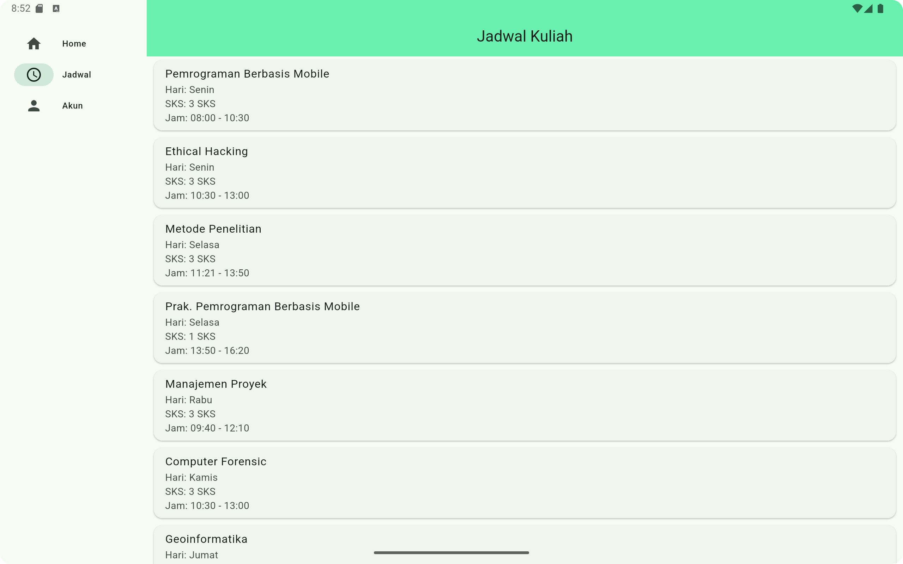

# Aplikasi Jadwal Kuliah dan Kegiatan Mahasiswa

Aplikasi untuk jadwal kuliah dan menyedeiakan checkbox untuk kegiatan mahasiswa

- Rizky Galih Dwiyanto
- 4522210074

## Screenshots

### ● Mobile

### Halaman Kegiatan Mahasiswa

### Halaman Jadwal Kuliah

### Halaman Akun

### ● Tablet

### Halaman Kegiatan Mahasiswa

### Halaman Jadwal Kuliah

### Halaman Akun

## Cara menjalankan aplikasi di Android Studio
1. Open project
2. Pada toolbar kanan, pilih Device Manager --> pilih emulator --> start emulator
3. Pada toolbar atas, pilih device yang akan digunakan
4. Klik tombol run, atau bisa gunakan shortcut Shift + F10
